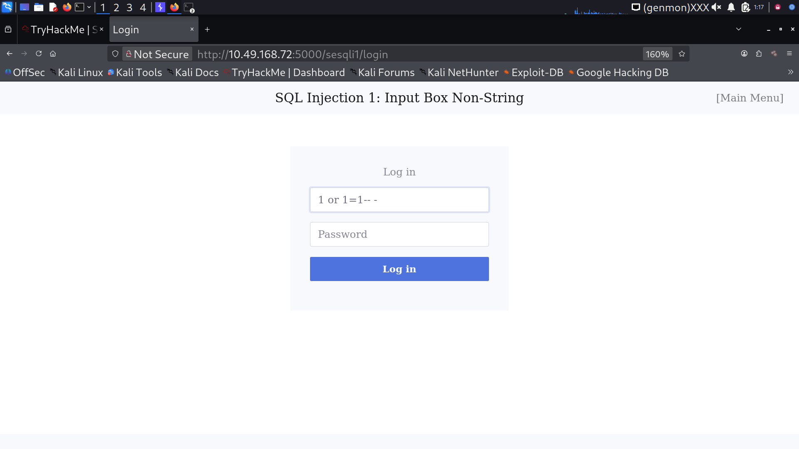
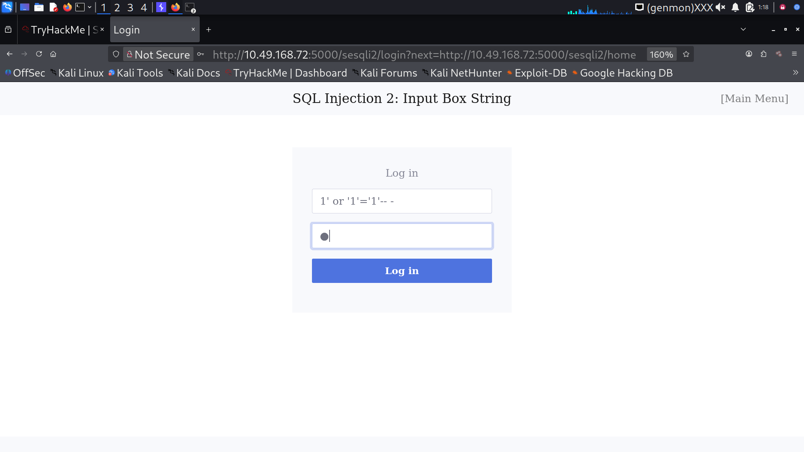
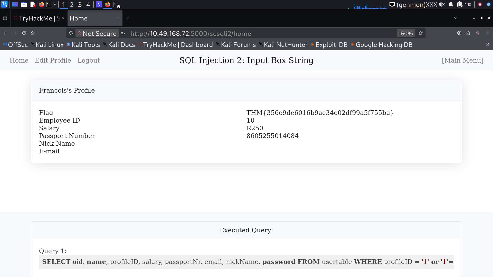
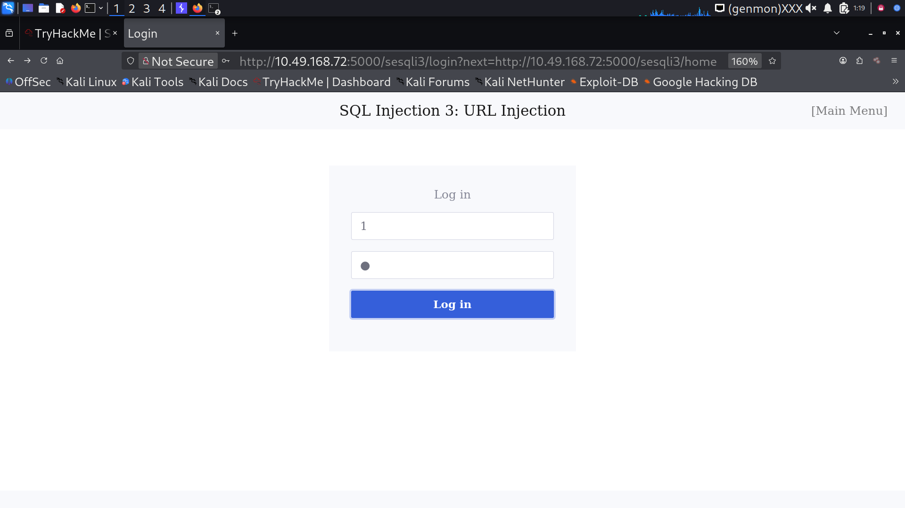
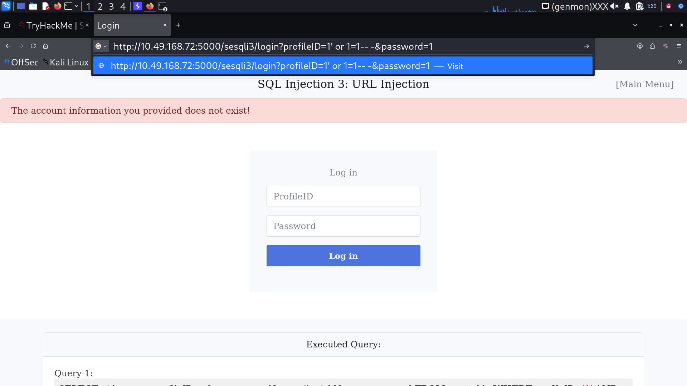
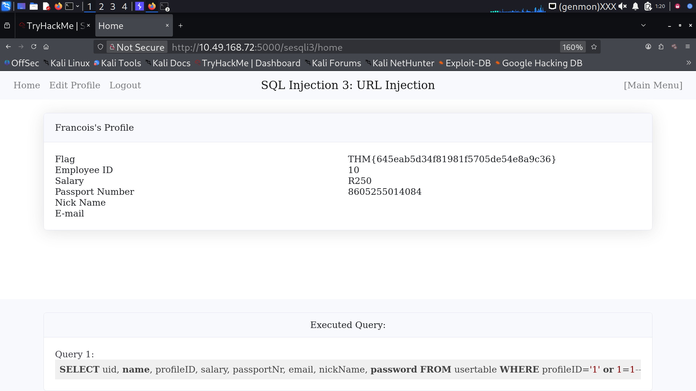
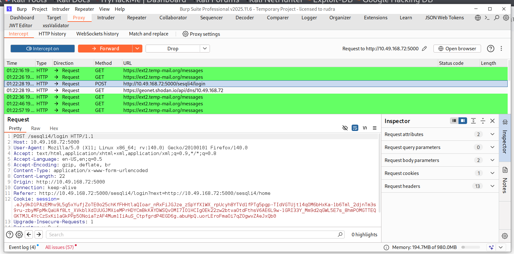
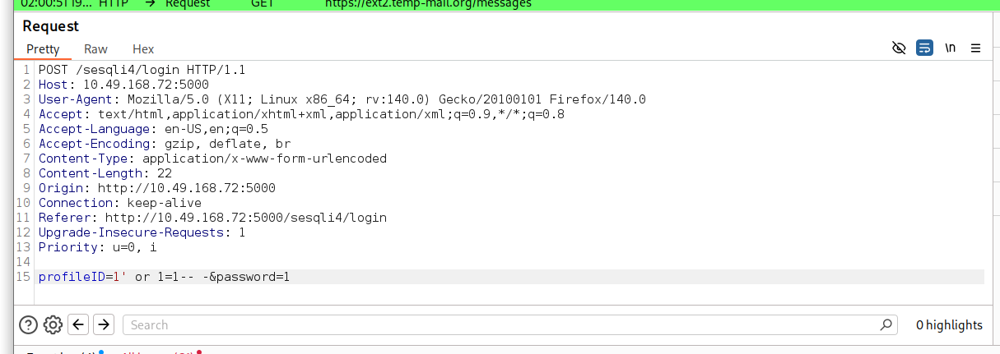
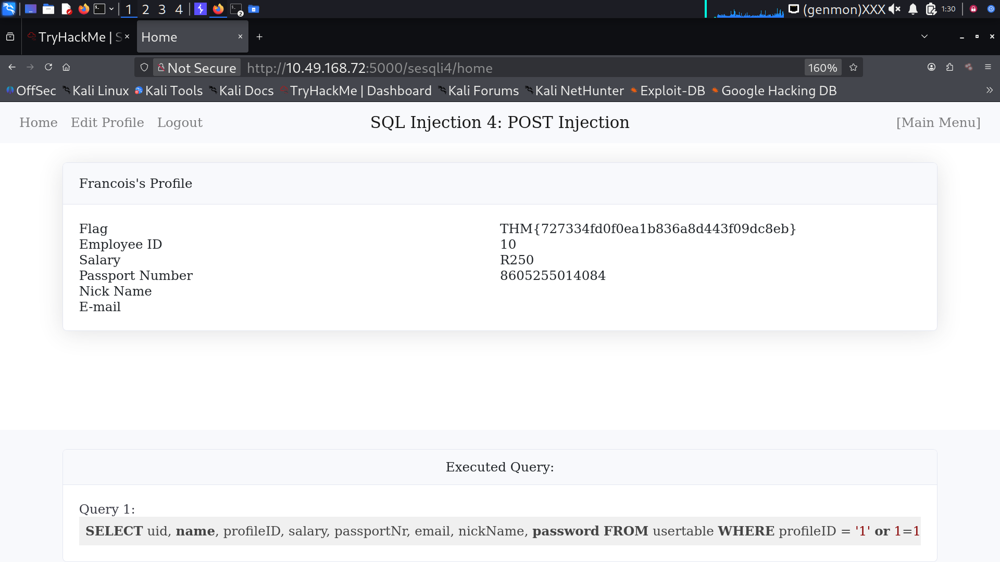

📌 1. Title
# SQL Injection Lab – Part 1 (Authentication Bypass)
📖 2. Overview

Explain in simple terms:

What is SQL Injection

Why it happens

What you did in this lab

Example:

This repository demonstrates practical SQL Injection attacks performed on a vulnerable web application. The focus is on authentication bypass using different input vectors including form input, URL parameters, and POST requests.

Techniques covered:
- Integer-based SQL Injection
- String-based SQL Injection
- GET (URL) Injection
- POST Injection using Burp Suite
⚙️ 3. Vulnerability Explanation

Add your concept here (you already wrote it, just clean it):

Dynamic queries

No input validation

String concatenation

🔥 4. Authentication Bypass Concept

Explain this payload:

' OR 1=1-- -

Break it down:

' → closes string

OR 1=1 → always true

-- - → comment rest

👉 This shows you understand, not just copy.

🧪 5. Lab 1 – Integer Based Injection
Payload:
1 or 1=1-- -
Explanation:

Input expects integer

No quotes needed

Condition becomes TRUE

Screenshots:

🧪 6. Lab 2 – String Based Injection
Payload:
1' or '1'='1'-- -
Explanation:

Input expects string

Need to break query using '

Screenshots:

🌐 7. Lab 3 – URL Injection (GET)
Payload:
-1' or 1=1-- -
Example:
http://target/login?profileID=-1' or 1=1-- -&password=a
Key Concept:

URL encoding (%27, %20)

Bypass client-side validation

Screenshots:

🛰️ 8. 🛰️ Lab 4 – POST Injection (Burp Suite)
Tool Used:

Burp Suite

Payload:
1' or '1'='1'-- -
Steps:

Intercept login request using Burp Suite

Capture POST request

Modify profileID parameter with payload

Forward request to server

Authentication bypass achieved

Screenshots:

⚠️ 9. Key Learnings

Write like this:

- Client-side validation can be bypassed
- Unsanitized input leads to SQL Injection
- Authentication mechanisms can be broken easily
- Burp Suite is effective for request manipulation
🛡️ 10. Prevention

This part is very important for interviews

- Use Prepared Statements (Parameterized Queries)
- Validate and sanitize user input
- Use ORM frameworks
- Apply least privilege to database users
- Avoid dynamic query concatenation
💡 11. Bonus (Optional but Powerful)

Add:

## Tools Used
- Burp Suite
- Browser DevTools
- Vulnerable Lab Environment
